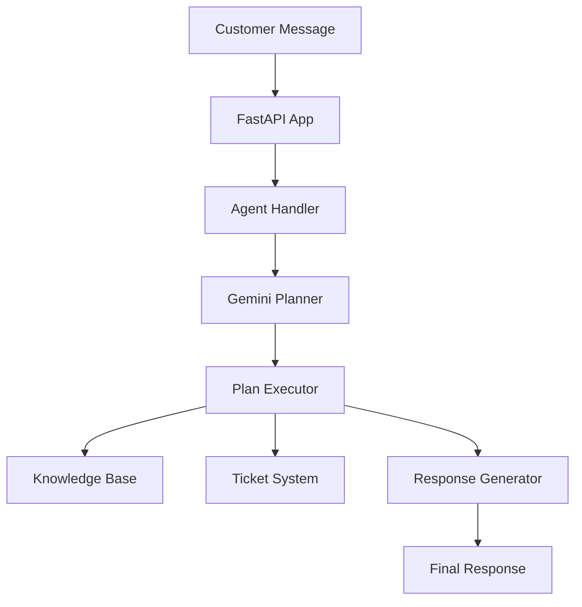

# Customer Service AI Agent

A sophisticated AI-powered customer service agent that provides automated, intelligent responses to customer inquiries using Google's Gemini AI model. The agent can search knowledge bases, create support tickets, and engage in natural language conversations with customers.

## Features

- **AI-Powered Responses**: Uses Google Gemini 2.0 Flash model for intelligent conversation
- **Knowledge Base Search**: Full-text search across comprehensive FAQ and support documentation
- **Support Ticket Management**: Automatic ticket creation for complex inquiries
- **HTTP API Integration**: RESTful API for easy integration with web applications
- **Database Management**: SQLite database with FTS5 full-text search capabilities
- **Real-time Processing**: Fast response times with proper error handling
- **Session Management**: Support for conversation continuity across sessions

## Quick Start

### 🚀 One-Click Setup (Recommended)

The fastest way to get started:

```bash
# Automatic setup and start
python quickstart.py
```

This script will:
- ✅ Check Python compatibility
- ✅ Install all dependencies
- ✅ Set up environment variables
- ✅ Initialize the database
- ✅ Start the agent server

### 🛠️ Manual Setup (Advanced Users)

#### Prerequisites

- Python 3.8 or higher
- Google Gemini API key

#### Step-by-Step Installation

1. **Get your Google Gemini API key**
   - Visit [Google AI Studio](https://aistudio.google.com/)
   - Create an API key

2. **Set up the environment**
   ```bash
   # Automated setup
   python setup.py
   
   # OR manual setup:
   pip install -r requirements.txt
   cp env_template.txt .env
   # Edit .env with your API key
   python src/db/init_db.py
   ```

3. **Start the agent**
   ```bash
   # Easy start with management script
   python run_agent.py start
   
   # Or direct start
   python src/app.py
   ```

### 🎯 Available Scripts

#### Setup Scripts
- `python setup.py` - Complete automated setup
- `python quickstart.py` - One-click setup and start

#### Management Scripts  
- `python run_agent.py start` - Start the agent server
- `python run_agent.py status` - Check system status
- `python run_agent.py test` - Run quick tests

#### Testing Scripts
- `python test_agent.py` - Basic functionality tests
- `python test_comprehensive.py` - Full test suite with performance tests

#### Platform-Specific Starters
- **Windows**: Double-click `start_agent.bat` or run `start_agent.bat`
- **Unix/Linux/Mac**: Run `./start_agent.sh`

The API will be available at `http://localhost:8000`

## 🤖 How The Agent Works - Complete Flow

### 🎯 Agent Architecture



### 🔄 Complete Workflow

#### 1. **Customer Sends Message**
```
POST /message → FastAPI receives request
{
  "customer_name": "John Doe",
  "customer_email": "john@example.com", 
  "text": "What is your return policy?",
  "session_id": "abc123"
}
```

#### 2. **AI Planning Phase** 🧠
The agent analyzes the message and creates an execution plan:

```python
# Gemini AI Planner receives:
"""
You are a Customer Support planner. Given this message:
"What is your return policy?"

Available tools: search_kb, create_ticket, http_get, respond
Create a JSON plan with steps.
"""

# Gemini Response:
{
  "plan": [
    {
      "action": "search_kb",
      "reason": "User asking about return policy - search knowledge base",
      "args": {"query": "return policy", "top_k": 5}
    },
    {
      "action": "respond",
      "reason": "Provide helpful response with found information", 
      "args": {"text": "Based on the information found..."}
    }
  ]
}
```

#### 3. **Execution Phase** ⚡
The agent executes each planned step:

```python
def execute_plan(plan):
    trace = []  # Debug logging
    
    for step in plan:
        if step["action"] == "search_kb":
            query = step["args"]["query"]
            results = kb.search_kb(query, top_k=5)
            trace.append({
                "action": "search_kb",
                "result": results,
                "reason": step["reason"]
            })
            
        elif step["action"] == "create_ticket":
            ticket_id = tickets.create_ticket(...)
            trace.append({
                "action": "create_ticket", 
                "result": {"ticket_id": ticket_id},
                "reason": step["reason"]
            })
```

#### 4. **Knowledge Base Search** 🔍
```sql
-- SQLite FTS5 Full Text Search
SELECT title, content FROM kb WHERE kb MATCH 'return policy' LIMIT 5

-- Returns:
[
  {
    "title": "Return Policy",
    "content": "Our return policy allows customers to return items within 30 days of purchase for a full refund. Items must be in original condition with tags attached..."
  }
]
```

#### 5. **Response Generation** ✨
```python
if not final_text:
    prompt = """
    Given this execution trace, write a friendly customer response:
    User: "What is your return policy?"
    Found: [return policy details]
    
    Write a helpful, polite response:
    """
    response = client.generate_content(prompt)
    final_text = response.text
```

#### 6. **Final Response** 📤
```json
{
  "reply": "Hi John! Thank you for reaching out. Our return policy allows you to return items within 30 days of purchase for a full退款...",
  "trace": [
    {
      "action": "search_kb",
      "reason": "Searching for return policy information",
      "args": {"query": "return policy", "top_k": 5},
      "result": [...]
    }
  ],
  "session_id": "abc123"
}
```

### 🛠️ Agent Tools

Your agent has access to these tools:

#### **Knowledge Base Search**
```python
# Searches comprehensive FAQ database
search_kb(query="shipping policy", top_k=5)
```
**Available Knowledge Areas:**
- Return Policy & Refunds  
- Shipping Information
- Payment Methods
- Product Warranty
- Account Management
- Technical Support
- Bulk Orders
- International Shipping
- Store Locations
- Live Chat Hours
- Price Match Policies
- Gift Cards

#### **Ticket Management**
```python
# Creates support tickets when needed
create_ticket(
    customer_name="John Doe",
    customer_email="john@example.com", 
    subject="Order inquiry", 
    body="Customer needs help with order status"
)
```

#### **HTTP Requests**
```python  
# Makes safe external API calls if needed
http_get(url="https://api.shipping-provider.com/track/tracking123")
```

## 🧪 Manual Testing Guide

### 🔧 Setup for Testing

1. **Start your agent:**
   ```bash
   python run_agent.py start
   ```
   
2. **Verify it's running:**
   ```bash
   curl http://localhost:8000/health
   # Should return: {"status": "healthy", "message": "All systems operational"}
   ```

### 📝 Test Scenarios

#### **Scenario 1: Return Policy Question**
```bash
curl -X POST http://localhost:8000/message \
  -H "Content-Type: application/json" \
  -d '{
    "customer_name": "Alice Smith",
    "customer_email": "alice@example.com",
    "text": "What is your return policy?",
    "session_id": "test_return_001"
  }'
```

**Expected Agent Response:**
- Searches KB for return policy information
- Provides comprehensive return details
- Execution trace shows KB search step

#### **Scenario 2: Complex Multi-Issue Request**
```bash
curl -X POST http://localhost:8000/message \
  -H "Content-Type: application/json" \
  -d '{
    "customer_name": "Bob Johnson",
    "customer_email": "bob@example.com", 
    "text": "I want to return something and also need help with shipping",
    "session_id": "test_complex_002"
  }'
```

**Expected Agent Response:**
- Searches KB for both return AND shipping information
- Combines information into comprehensive response
- May create ticket if needed

#### **Scenario 3: Ticket Creation Request**
```bash
curl -X POST http://localhost:8000/message \
  -H "Content-Type: application/json" \
  -d '{
    "customer_name": "Carol Davis",
    "customer_email": "carol@example.com",
    "text": "My order from last week still hasnt arrived and I need urgent help",
    "session_id": "test_ticket_003"
  }'
```

**Expected Agent Response:**
- Searches KB for shipping/delivery information
- Creates a support ticket automatically
- Provides ticket ID and next steps

### 🎫 **Ticket Management Testing**

#### **View All Open Tickets:**
```bash
curl http://localhost:8000/tickets
```

**Response:**
```json
{
  "tickets": [
    {
      "id": 123,
      "customer_name": "Carol Davis", 
      "subject": "Order inquiry",
      "created_at": "2024-01-15 10:30:00"
    }
  ]
}
```

#### **Test Ticket Creation via Agent:**
```bash
# This should create a ticket automatically
curl -X POST http://localhost:8000/message \
  -H "Content-Type: application/json" \
  -d '{
    "customer_name": "Test User",
    "customer_email": "test@example.com",
    "text": "I have a problem with my order and need immediate assistance",
    "session_id": "ticket_test"
  }'
```

#### **Manual Ticket Creation:**
```bash
curl -X POST http://localhost:8000/tickets \
  -H "Content-Type: application/json" \
  -d '{
    "customer_name": "Manual Test",
    "customer_email": "manual@example.com", 
    "subject": "Manual ticket creation",
    "body": "This ticket was created manually for testing"
  }'
```

### 🔍 **Knowledge Base Testing**

#### **Direct KB Search:**
```bash
# Search for return-related information
curl "http://localhost:8000/kb/search?q=return+policy&top_k=3"

# Search for shipping information  
curl "http://localhost:8000/kb/search?q=shipping+time&top_k=5"

# Search for payment methods
curl "http://localhost:8000/kb/search?q=payment+methods&top_k=3"
```

#### **Test Different Query Types:**
```bash
# Broad query
curl "http://localhost:8000/kb/search?q=help&top_k=10"

# Specific query
curl "http://localhost:8000/kb/search?q=warranty+claims&top_k=2"

# Multi-word query
curl "http://localhost:8000/kb/search?q=international+shipping+costs&top_k=3"
```

### 📊 **Testing Conversation Flow**

#### **Session-Based Conversation:**
```bash
# Start a conversation session
SESSION_ID="conversation_test_$(date +%s)"

# First message
curl -X POST http://localhost:8000/message \
  -H "Content-Type: application/json" \
  -d '{
    "customer_name": "Conversation User",
    "customer_email": "conversation@example.com",
    "text": "Hello, I need help",
    "session_id": "'$SESSION_ID'"
  }'

# Follow-up message (same session)
curl -X POST http://localhost:8000/message \
  -H "Content-Type: application/json" \
  -d '{
    "customer_name": "Conversation User",
    "customer_email": "conversation@example.com", 
    "text": "Actually, I want to know about your return policy",
    "session_id": "'$SESSION_ID'"
  }'
```

### 🚀 **Load Testing**

#### **Concurrent Requests:**
```bash
# Test multiple simultaneous requests
for i in {1..5}; do
  curl -X POST http://localhost:8000/message \
    -H "Content-Type: application/json" \
    -d '{
      "customer_name": "Load Test User '$i'",
      "customer_email": "loadtest'$i'@example.com",
      "text": "Test message '$i'",
      "session_id": "load_test_'$i'"
    }' &
done
wait
```

### 🔍 **Debugging & Monitoring**

#### **View Execution Traces:**
Every response includes detailed execution traces:
```json
{
  "reply": "...",
  "trace": [
    {
      "action": "search_kb",
      "reason": "User asking about returns",
      "args": {"query": "return policy", "top_k": 5},
      "result": [...]
    },
    {
      "action": "synthesize_reply", 
      "result": "Generated helpful response"
    }
  ]
}
```

#### **Check System Health:**
```bash
# Basic health check
curl http://localhost:8000/health

# Detailed status
python run_agent.py status
```

#### **Monitor Logs:**
Start with debug mode to see detailed logs:
```bash
python run_agent.py start --debug
```

## 📚 API Documentation

### **Interactive Documentation**
- **Swagger UI:** `http://localhost:8000/docs`
- **ReDoc:** `http://localhost:8000/redoc`

### **Main Endpoints**

#### **POST /message** - Send Customer Message
```bash
curl -X POST http://localhost:8000/message \
  -H "Content-Type: application/json" \
  -d '{
    "customer_name": "John Doe",
    "customer_email": "john@example.com",
    "text": "What is your return policy?",
    "session_id": "session_123"
  }'
```

**Response:**
```json
{
  "reply": "Hi John! Here's your return policy information...",
  "trace": [
    {
      "action": ".search_kb",
      "reason": "Searching for return policy information",
      "args": {"query": "return policy", "top_k": 5},
      "result": [...]
    }
  ],
  "session_id": "session_123",
  "confidence": 0.95
}
```

#### **GET /kb/search** - Direct Knowledge Base Search
```bash
curl "http://localhost:8000/kb/search?q=shipping+policy&top_k=3"
```

#### **GET /tickets** - List Open Tickets
```bash
curl http://localhost:8000/tickets
```

#### **GET /health** - Health Check
```bash
curl http://localhost:8000/health
```

### 🎫 **Complete Ticket Lifecycle**

#### **1. Ticket Creation (Automatic)**
When customer has complex issues, agent creates tickets automatically:

```bash
# Test ticket creation
curl -X POST http://localhost:8000/message \
  -H "Content-Type: application/json" \
  -d '{
    "customer_name": "Troubled Customer",
    "customer_email": "customer@example.com",
    "text": "My order is missing items and the tracking shows delivered but I never received anything. This is very urgent!",
    "session_id": "urgent_ticket_test"
  }'
```

**Agent Response Example:**
```json
{
  "reply": "I understand this is urgent! I've immediately created ticket #1567 for your issue with the missing order. Our team will prioritize this and contact you within 2 hours...",
  "trace": [
    {
      "action": "search_kb",
      "reason": "Searching for order delivery policies",
      "result": [...]
    },
    {
      "action": "create_ticket", 
      "reason": "Customer has urgent delivery issue requiring human intervention",
      "result": {"ticket_id": 1567}
    }
  ]
}
```

#### **2. Manual Ticket Creation**
```bash
# Create ticket directly via API
curl -X POST http://localhost:8000/tickets \
  -H "Content-Type: application/json" \
  -d '{
    "customer_name": "Manual User",
    "customer_email": "manual@example.com",
    "subject": "Website Issue", 
    "body": "The checkout page is not working properly",
    "priority": "medium"
  }'
```

#### **3. View All Tickets**
```bash
# List all open tickets
curl http://localhost:8000/tickets

# List specific ticket by ID (if implemented)
curl http://localhost:8000/tickets/1567
```

#### **4. Update Ticket Status** 
```bash
# Close a ticket (via database direct access)
python -c "
from src.tools.tickets import update_ticket_status
success = update_ticket_status(1567, 'closed')
print(f'Ticket closed: {success}')
"

# Change ticket status  
python -c "
from src.tools.tickets import update_ticket_status
success = update_ticket_status(1567, 'in_progress') 
print(f'Ticket status updated: {success}')
"
```

#### **5. Ticket Status Values**
- `open` - Newly created ticket (default)
- `in_progress` - Being worked on by support team
- `pending` - Waiting for customer response
- `closed` - Resolved/completed

#### **6. Complete Ticket Workflow Example**

```bash
# Step 1: Create ticket via agent
TICKET_RESPONSE=$(curl -s -X POST http://localhost:8000/message \
  -H "Content-Type: application/json" \
  -d '{
    "customer_name": "Workflow Test User",
    "customer_email": "workflow@example.com", 
    "text": "I need urgent help with my account access",
    "session_id": "workflow_test"
  }')

echo "Agent Response:"
echo $TICKET_RESPONSE | python -m json.tool

# Step 2: List tickets to see the new one
echo "All Open Tickets:"
curl -s http://localhost:8000/tickets | python -m json.tool

# Step 3: Update ticket status (in_progress)
echo "Updating ticket status to 'in_progress'..."
python -c "
from src.tools.tickets import update_ticket_status
# Get latest ticket ID (assuming it's the highest)
import sqlite3
conn = sqlite3.connect('src/db/agent_data.db')
c = conn.cursor()
c.execute('SELECT MAX(id) FROM tickets')
ticket_id = c.fetchone()[0]
conn.close()
print(f'Updating ticket #{ticket_id}')
success = update_ticket_status(ticket_id, 'in_progress')
print(f'Status update: {success}')
"

# Step 4: Close ticket when resolved
echo "Closing ticket..."
python -c "
from src.tools.tickets import update_ticket_status
import sqlite3
conn = sqlite3.connect('src/db/agent_data.db')
c = conn.cursor()
c.execute('SELECT MAX(id) FROM tickets')
ticket_id = c.fetchone()[0]
conn.close()
success = update_ticket_status(ticket_id, 'closed')
print(f'Ticket #{ticket_id} closed: {success}')
"
```

### 🗃️ **Database Direct Access**

For advanced testing and management, you can interact directly with the database:

#### **View All Tickets:**
```python
python -c "
import sqlite3
conn = sqlite3.connect('src/db/agent_data.db')
c = conn.cursor()
c.execute('SELECT * FROM tickets ORDER BY created_at DESC')
tickets = c.fetchall()
conn.close()

print('All Tickets:')
for ticket in tickets:
    print(f'ID: {ticket[0]}, Customer: {ticket[1]}, Status: {ticket[5]}, Created: {ticket[6]}')
"
```

#### **View Knowledge Base Entries:**
```python
python -c "
import sqlite3
conn = sqlite3.connect('src/db/agent_data.db')
c = conn.cursor()
c.execute('SELECT title, category FROM kb LIMIT 10')
entries = c.fetchall()
conn.close()

print('Knowledge Base Entries:')
for entry in entries:
    print(f'Title: {entry[0]}, Category: {entry[1]}')
"
```

#### **Add New Knowledge Base Entry:**
```python
python -c "
from src.tools.kb import add_kb_entry
success = add_kb_entry(
    title='Customer Loyalty Program',
    content='Our loyalty program offers exclusive benefits including faster shipping, exclusive discounts, and priority customer support.',
    category='Programs',
    tags='loyalty benefits exclusive premium'
)
print(f'Knowledge entry added: {success}')
"
```

## 🔄 **Complete Code Flow & Architecture**

### **Directory Structure**
```
customer_service_agent/
├── src/
│   ├── app.py              # FastAPI web application
│   ├── agent.py            # Core AI agent logic
│   ├── db/
│   │   ├── init_db.py      # Database initialization
│   │   └── agent_data.db   # SQLite database file
│   ├── tools/
│   │   ├── __init__.py     # Package initialization
│   │   ├── kb.py           # Knowledge base operations
│   │   ├── tickets.py      # Ticket management
│   │   └── http_tool.py    # External API calls
│   └── utils/              # Utility functions (future)
├── config/
│   └── config.yaml         # Configuration file
├── requirements.txt        # Python dependencies
├── setup.py               # Automated setup script
├── run_agent.py           # Agent management script
├── test_agent.py          # Basic testing
├── test_comprehensive.py  # Full test suite
├── quickstart.py          # One-click startup
└── README.md             # This documentation
```

### **Code Execution Flow**

#### **1. Application Startup (`app.py`)**
```python
@asynccontextmanager
async def lifespan(app: FastAPI):
    """Initialize resources on startup."""
    # Initialize database
    from db.init_db import init_db
    init_db()
    
    yield
    
    # Cleanup on shutdown

app = FastAPI(title="Customer Service Agent API", lifespan=lifespan)

# Add CORS middleware
app.add_middleware(CORSMiddleware, allow_origins=["*"])

# Health check endpoint
@app.get("/health")
async def health_check():
    # Test database connectivity
    from tools.kb import search_kb
    search_kb("test", top_k=1)
    return {"status": "healthy"}

# Main message endpoint
@app.post("/message", response_model=MessageOut)
async def message_endpoint(msg: MessageIn):
    # Validate input data
    # Call agent handler
    response = handle_user_message(msg.text, metadata)
    return response
```

#### **2. Agent Processing (`agent.py`)**
```python
def handle_user_message(user_message: str, metadata: Dict[str, Any]):
    """Main agent entry point."""
    
    # STEP 1: Generate execution plan
    planner_out = call_gemini_planner(user_message, metadata)
    plan = planner_out.get("plan", [])
    
    # STEP 2: Execute the plan
    res = execute_plan(plan)
    return res

def call_gemini_planner(user_message: str, context: Dict[str, Any]):
    """Use Gemini AI to create execution plan."""
    
    prompt = f"""
    You are a Customer Support planner. Given this message:
    "{user_message}"
    
    Available tools: {json.dumps(TOOLS, indent=0)}
    
    Return JSON plan with steps:
    """
    
    response = client.generate_content(prompt)
    return json.loads(response.text)

def execute_plan(plan: List[Dict[str, Any]]):
    """Execute each step in the plan."""
    trace = []
    final_text = None
    
    for step in plan:
        action = step.get("action")
        args = step.get("args", {})
        reason = step.get("reason", "")
        
        # Execute the action
        if action == "search_kb":
            q = args.get("query")
            top_k = args.get("top_k", 5)
            result = kb.search_kb(q, top_k=top_k)
            
        elif action == "create_ticket":
            result = tickets.create_ticket(
                args.get("customer_name", "unknown"),
                args.get("customer_email", "unknown"),
                args.get("subject", "no-subject"),
                args.get("body", "")
            )
            
        elif action == "http_get":
            result = http_tool.http_get(args.get("url"))
            
        elif action == "respond":
            final_text = args.get("text")
            
        # Track execution
        trace.append({
            "action": action,
            "reason": reason,
            "args": args,
            "result": result
        })
    
    # Generate response if not provided
    if not final_text:
        final_text = synthesize_response(trace)
        trace.append({"action": "synthesize_reply", "result": final_text})
    
    return {"final_text": final_text, "trace": trace}
```

#### **3. Knowledge Base Operations (`tools/kb.py`)**
```python
def search_kb(query: str, top_k: int = 5) -> List[Dict[str, str]]:
    """Search knowledge base using full-text search."""
    
    conn = sqlite3.connect(DB_PATH)
    c = conn.cursor()
    
    # Check schema compatibility
    c.execute("PRAGMA table_info(kb)")
    columns = [col[1] for col in c.fetchall()]
    
    if 'category' in columns:
        # Advanced schema
        c.execute("SELECT title, content FROM kb WHERE kb MATCH ? ORDER BY rank LIMIT ?", (query, top_k))
    else:
        # Basic schema
        c.execute("SELECT title, content FROM kb WHERE kb MATCH ? LIMIT ?", (query, top_k))
        
    rows = c.fetchall()
    conn.close()
    
    return [{"title": row[0], "content": row[1]} for row in rows]

def add_kb_entry(title: str, content: str) -> bool:
    """Add new knowledge base entry."""
    # Implementation with error handling...
```

#### **4. Ticket Management (`tools/tickets.py`)**
```python
def create_ticket(customer_name: str, customer_email: str, subject: str, body: str) -> Optional[int]:
    """Create a new support ticket."""
    
    conn = sqlite3.connect(DB_PATH)
    c = conn.cursor()
    
    # Validate inputs
    if not customer_name or not customer_email or not subject:
        return None
    
    # Insert ticket
    c.execute("INSERT INTO tickets(customer_name, customer_email, subject, body) VALUES(?,?,?,?)",
              (customer_name.strip(), customer_email.strip(), subject.strip(), body.strip()))
    
    ticket_id = c.lastrowid
    conn.commit()
    conn.close()
    
    return ticket_id

def update_ticket_status(ticket_id: int, new_status: str) -> bool:
    """Update ticket status."""
    # Implementation with validation...
```

#### **5. Database Schema (`db/init_db.py`)**
```python
def init_db():
    """Initialize database with tables and sample data."""
    
    conn = sqlite3.connect(DB_PATH)
    c = conn.cursor()
    
    # Create tickets table
    c.execute('''
    CREATE TABLE IF NOT EXISTS tickets (
        id INTEGER PRIMARY KEY AUTOINCREMENT,
        customer_name TEXT NOT NULL,
        customer_email TEXT NOT NULL,
        subject TEXT NOT NULL,
        body TEXT,
        status TEXT DEFAULT 'open' CHECK(status IN ('open', 'in_progress', 'closed', 'pending')),
        priority TEXT DEFAULT 'medium' CHECK(priority IN ('low', 'medium', 'high', 'urgent')),
        created_at TIMESTAMP DEFAULT CURRENT_TIMESTAMP,
        updated_at TIMESTAMP DEFAULT CURRENT_TIMESTAMP
    )''')
    
    # Create FTS5 knowledge base table
    c.execute('''
    CREATE VIRTUAL TABLE IF NOT EXISTS kb USING fts5(
        title, 
        content, 
        category,
        tags
    )''')
    
    # Insert comprehensive sample data
    kb_samples = [
        ("Return Policy", "Our return policy allows customers to return items within 30 days...", "Policies", "return refund"),
        ("Shipping Information", "We offer multiple shipping options...", "Shipping", "shipping standard express"),
        # ... more samples
    ]
    
    for title, content, category, tags in kb_samples:
        c.execute("INSERT INTO kb(title, content, category, tags) VALUES(?, ?, ?, ?)", 
                 (title, content, category, tags))
    
    conn.commit()
    conn.close()
```

### **API Request/Response Cycle**

#### **Complete Request Flow:**

1. **Client sends HTTP POST:**
```bash
curl -X POST http://localhost:8000/message \
  -H "Content-Type: application/json" \
  -d '{"text": "What is your return policy?", "customer_name": "John"}'
```

2. **FastAPI receives and validates:**
```python
# Request validation via Pydantic
class MessageIn(BaseModel):
    customer_name: Optional[str] = Field(None, max_length=100)
    customer_email: Optional[EmailStr] = None
    text: str = Field(..., min_length=1, max_length=2000)
    session_id: Optional[str] = None
```

3. **Agent processing:**
```python
# Call agent handler
metadata = {"customer_name": "John", "customer_email": None}
response = handle_user_message("What is your return policy?", metadata)
```

4. **Gemini AI planning:**
```python
# AI creates execution plan
{
  "plan": [
    {"action": "search_kb", "args": {"query": "return policy", "top_k": 5}},
    {"action": "respond", "args": {"text": "Based on our return policy..."}}
  ]
}
```

5. **Plan execution:**
```python
# Execute each planned step
trace = []
for step in plan:
    result = execute_action(step["action"], step["args"])
    trace.append({"action": step["action"], "result": result})
```

6. **Response generation:**
```python
# Generate final customer-friendly response
response = client.generate_content(prompt_with_context)
```

7. **HTTP response:**
```json
{
  "reply": "Hi John! Our return policy allows you to return items within 30 days...",
  "trace": [...],
  "session_id": "session_123"
}
```

### **Error Handling Flow**

```python
try:
    # API key validation
    api_key = os.getenv("GEMINI_API_KEY")
    if not api_key or api_key == "your_gemini_api_key_here":
        raise RuntimeError("Invalid API key")
    
    # Database operations with error handling
    try:
        results = kb.search_kb(query)
    except sqlite3.Error as e:
        logger.error(f"Database error: {e}")
        return {"error": "Database unavailable"}
    
    # AI API calls with retry logic
    try:
        response = client.generate_content(prompt)
    except Exception as e:
        logger.error(f"AI API error: {e}")
        return {"error": "AI service unavailable"}
        
except Exception as e:
    logger.error(f"Unexpected error: {e}")
    raise HTTPException(status_code=500, detail=str(e))
```

## 📊 **Real-World Testing Examples**

### **Test Case 1: E-commerce Customer Journey**

```bash
# Customer browses products (simulated)
curl -X POST http://localhost:8000/message \
  -H "Content-Type: application/json" \
  -d '{
    "customer_name": "Sarah Wilson",
    "customer_email": "sarah@example.com",
    "text": "What payment methods do you accept?",
    "session_id": "sarah_shopping_session"
  }'

# Customer has shipping question
curl -X POST http://localhost:8000/message \
  -H "Content-Type: application/json" \
  -d '{
    "customer_name": "Sarah Wilson", 
    "customer_email": "sarah@example.com",
    "text": "How long does shipping take to California?",
    "session_id": "sarah_shopping_session"
  }'

# Customer wants to buy in bulk
curl -X POST http://localhost:8000/message \
  -H "Content-Type: application/json" \
  -d '{
    "customer_name": "Sarah Wilson",
    "customer_email": "sarah@example.com", 
    "text": "I want to buy 100 units for my company, do you have bulk pricing?",
    "session_id": "sarah_shopping_session"
  }'
```

### **Test Case 2: Post-Purchase Support**

```bash
# Customer received wrong item
curl -X POST http://localhost:8000/message \
  -H "Content-Type: application/json" \
  -d '{
    "customer_name": "Mike Johnson",
    "customer_email": "mike@example.com",
    "text": "I received the wrong item in my order. What should I do?",
    "session_id": "mike_post_purchase"
  }'

# Customer needs technical help
curl -X POST http://localhost:8000/message \
  -H "Content-Type: application/json" \
  -d '{
    "customer_name": "Lisa Brown",
    "customer_email": "lisa@example.com",
    "text": "The product I bought is defective and keeps shutting off.",
    "session_id": "lisa_technical_issue"
  }'
```

#### GET /health
Check the health status of the service.

#### GET /kb/search
Directly search the knowledge base.

#### GET /tickets
List open support tickets.

## Configuration

The agent can be configured through environment variables:

- `GEMINI_API_KEY`: Your Google Gemini API key (required)
- `GEMINI_MODEL`: Model to use (default: gemini-2.0-flash-exp)
- `AGENT_HOST`: Server host (default: 0.0.0.0)
- `AGENT_PORT`: Server port (default: 8000)
- `DEBUG`: Enable debug mode (true/false)

## Knowledge Base

The agent comes with a comprehensive knowledge base covering:

- Return policies and refunds
- Shipping information and tracking
- Payment methods and processing
- Product warranties and support
- Account management features
- Technical support procedures
- Store locations and hours
- Bulk orders and pricing
- International shipping
- Live chat availability
- Price matching policies
- Gift cards and promotions

You can add more entries by directly inserting into the database or using the admin tools.

## Architecture

The agent follows a modular architecture:

```
src/
├── app.py              # FastAPI application
├── agent.py            # Core AI agent logic
├── db/
│   ├── init_db.py     # Database initialization
│   └── agent_data.db  # SQLite database
└── tools/
    ├── kb.py          # Knowledge base operations
    ├── tickets.py     # Ticket management
    └── http_tool.py   # HTTP requests
```

### Agent Flow

1. **Message Received**: Customer message comes through API
2. **Planning**: AI analyzes the message and creates an execution plan
3. **Tool Execution**: Relevant tools are called (KB search, ticket creation, etc.)
4. **Response Generation**: AI synthesizes the final response
5. **Trace Logging**: Full execution trace is logged for debugging

## Customization

### Adding New Tools

To add new capabilities to the agent:

1. Create a new function in the appropriate tool module
2. Add the tool to the `TOOLS` dictionary in `agent.py`
3. Add the execution logic in the `execute_plan` function

### Expanding Knowledge Base

Add more entries to the knowledge base:

```python
from tools.kb import add_kb_entry

add_kb_entry(
    title="Custom Policy",
    content="Details about your custom policy...",
    category="Policies",
    tags="custom-policy specific-terms"
)
```

### Custom Responses

Modify the prompt templates in `agent.py` to customize the agent's personality and response style.

## Testing

### Manual Testing

Use curl to test the API:

```bash
curl -X POST "http://localhost:8000/message" \
  -H "Content-Type: application/json" \
  -d '{
    "customer_name": "Test Customer",
    "customer_email": "test@example.com",
    "text": "What is your return policy?",
    "session_id": "test_session"
  }'
```

### Example Interactions

**Customer**: "I want to return something I bought last week"
**Agent**: "I'd be happy to help you with your return! Our return policy allows you to return items within 30 days of purchase..."

**Customer**: "I haven't received my order yet"
**Agent**: "[Creates a support ticket] "I've created a support ticket (#12345) for your order inquiry. Our shipping team will investigate..."

## Testing

### 🧪 Quick Tests

```bash
# Basic functionality test
python test_agent.py

# Comprehensive test suite
python test_comprehensive.py

# Performance and load testing
python test_comprehensive.py --skip-api
```

### Test Scenarios Covered

- ✅ Environment setup validation
- ✅ Database operations (KB search, ticket creation)
- ✅ AI agent message processing
- ✅ Performance metrics (response times)
- ✅ Error handling (empty messages, special chars)
- ✅ API endpoint functionality
- ✅ Load simulation (concurrent requests)

## Troubleshooting

### 🛠️ Common Issues

#### Setup Issues
1. **Python Version**: Ensure Python 3.8+ is installed
   ```bash
   python --version  # Should show 3.8 or higher
   ```

2. **API Key Problems**: 
   ```bash
   # Check if API key is set
   python run_agent.py status
   
   # Fix: Edit .env file with correct API key
   ```

3. **Dependencies**: Run automated setup to fix most issues
   ```bash
   python setup.py
   ```

#### Runtime Issues
1. **Database Errors**: Reset and reinitialize
   ```bash
   python -c "from src.db.init_db import reset_db; reset_db()"
   ```

2. **Import Errors**: Reinstall dependencies
   ```bash
   pip install -r requirements.txt
   ```

3. **Server Won't Start**: Check port availability
   ```bash
   python run_agent.py start --port 8001  # Use different port
   ```

### 🔍 Debugging

#### Check System Status
```bash
python run_agent.py status
```

#### Test Core Functionality
```bash
python test_agent.py
```

#### View Detailed Logs
Start the server with debug mode:
```bash
python run_agent.py start --debug
```

#### Manual Test API
```bash
curl -X POST http://localhost:8000/message \
  -H "Content-Type: application/json" \
  -d '{"text": "Hello, can you help me?"}'
```

### 📞 Getting Help

If you're still having issues:
1. Run `python test_comprehensive.py` to see detailed error reports
2. Check that your Google Gemini API key is valid and has sufficient quota
3. Ensure firewall/antivirus isn't blocking port 8000

## Docker Deployment (Optional)

Create a `Dockerfile`:

```dockerfile
FROM python:3.11-slim

WORKDIR /app
COPY requirements.txt .
RUN pip install -r requirements.txt

COPY . .
EXPOSE 8000

CMD ["python", "src/app.py"]
```

Build and run:
```bash
docker build -t customer-service-agent .
docker run -p 8000:8000 -e GEMINI_API_KEY=your_key customer-service-agent
```

## License

This project is licensed under the MIT License.

## Support

For support or questions about the Customer Service Agent, please create an issue in the repository or contact the development team.
